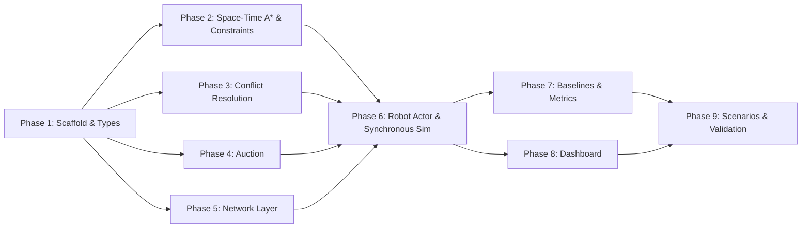

# SIH26123 — Agent-Executable Rust Implementation Plan (v5)

> **Problem:** Edge-AI Based Distributed Fleet Coordination for AMRs in Smart Warehouses
> **Org:** Bharat Electronics Limited (BEL) · **Language:** Rust 1.98 (2024 edition)
> **Toolchain:** `rustc 1.98.0`, `cargo 1.98.0`
> **Project Root:** `/home/sanjeev/Downloads/SIH26123/sih26123/`
> **Hard Success Criteria:** Zero inter-robot collisions AND ≥20% mean makespan reduction vs stop-and-wait baseline on ≥3 AMRs.

---

## Design Principles (enforced across all phases)

1. **No shared mutable state.** Each `RobotActor` owns its own local reservation table, peer intent store, wait-for graph, peer tracker, and auction state. No `Arc<Mutex<>>` for coordination data.
2. **P2P is real & asynchronous.** UDP multicast transport runs asynchronously on edge hardware with background socket workers.
3. **Tick-scoped simulation message delivery.** For deterministic simulation and benchmarking, message delivery across simulated nodes is tick-scoped (messages sent at tick $t$ are staged and delivered into peer inboxes for tick $t+1$), while the underlying UDP transport remains fully asynchronous.
4. **Explicit cell and edge constraints.** Peer intents are never flattened or discarded. Space-Time A\* plans against explicit `SpaceTimeConstraints` (forbidden vertices and directional edge swaps) aggregated from all peer `IntentRecord`s and local reservations.
5. **Versioned deterministic conflict resolution.** Conflicts are resolved using the fixed priority attached to the specific `IntentMsg` contested, identified by `(robot_id, seq, priority)`. Priority does not dynamically mutate mid-plan. Under stale/missing data, robots safely yield.
6. **Common envelope with per-message sequencing.** Every outgoing message is wrapped in `Envelope { sender_id, seq, payload }`. The `seq` counter increments per outgoing message. Dedup uses `(sender_id, seq)`.
7. **Local sensing for dynamic obstacles.** Robots observe blocked cells via a local `sense()` interface, updating local maps without centralized injection commands.
8. **Narrowly scoped WFG.** The Wait-For Graph is used solely for multi-robot deadlock-cycle detection. Pairwise conflicts use direct priority arbitration.
9. **Synchronous 5-phase tick cycle.** Simulation ticks execute: `sense → decide → deliver/flush → simultaneous movement → evaluate`. Robot iteration order never influences outcomes.
10. **Observational evaluation only.** Evaluator and dashboard only observe telemetry.

---

## How to Use This Plan

Each phase is self-contained. Execute in order. For every phase:

1. **Create** the listed files.
2. **Run** the verification command.
3. **DONE if and only if** the verification command exits 0 with all assertions passing.
4. Do NOT proceed until current phase passes.

---

## Phase 1: Cargo Workspace Scaffold & Core Types

**Goal:** Compiling Cargo project with grid world, envelope-wrapped message protocol, task status tracking, and robot state enum.

### 1.1 Initialize Cargo project

```bash
cargo init --name sih26123 /home/sanjeev/Downloads/SIH26123/sih26123
```

### 1.2 Set `Cargo.toml` dependencies

File: `/home/sanjeev/Downloads/SIH26123/sih26123/Cargo.toml`

```toml
[package]
name = "sih26123"
version = "0.1.0"
edition = "2024"

[dependencies]
tokio = { version = "1", features = ["full"] }
serde = { version = "1", features = ["derive"] }
serde_json = "1"
axum = { version = "0.8", features = ["ws"] }
clap = { version = "4", features = ["derive"] }
tracing = "0.1"
tracing-subscriber = { version = "0.3", features = ["env-filter"] }
rand = "0.9"
tower-http = { version = "0.6", features = ["fs", "cors"] }
async-trait = "0.1"

[dev-dependencies]
tokio-test = "0.4"
```

### 1.3 Create `src/world/grid.rs`

```rust
#[derive(Debug, Clone, Copy, PartialEq, Eq, Hash, Serialize, Deserialize)]
pub enum Cell { Free, Wall, Pickup(u32), Dropoff(u32) }

#[derive(Debug, Clone, Copy, PartialEq, Eq, Hash, Serialize, Deserialize, PartialOrd, Ord)]
pub struct Pos { pub x: usize, pub y: usize }

#[derive(Debug, Clone, Serialize, Deserialize)]
pub struct GridMap { pub width: usize, pub height: usize, pub cells: Vec<Vec<Cell>> }
```

Implement on `GridMap`:
- `fn new(width, height) -> Self` — all `Free`.
- `fn set_cell(&mut self, pos, cell)` — panics if OOB.
- `fn get_cell(&self, pos) -> Cell`
- `fn is_walkable(&self, pos) -> bool` — `Free`, `Pickup(_)`, or `Dropoff(_)`.
- `fn in_bounds(&self, pos) -> bool`
- `fn neighbors(&self, pos) -> Vec<Pos>` — up to 4 cardinal walkable neighbors.
- `fn generate_warehouse(width, height, aisle_spacing) -> Self` — horizontal shelf rows with gaps at edges/center. 2 `Pickup` + 2 `Dropoff` at opposite corners.

Implement on `Pos`:
- `fn new(x, y) -> Self`
- `fn manhattan_distance(&self, other: &Pos) -> usize`

### 1.4 Create `src/protocol/messages.rs`

```rust
pub type RobotId = u32;
pub type TaskId = u32;
pub type Tick = u64;
pub type SeqNum = u64;

/// Every outgoing message is wrapped in an Envelope.
/// `seq` increments for EVERY outgoing message.
#[derive(Debug, Clone, Serialize, Deserialize)]
pub struct Envelope {
    pub sender_id: RobotId,
    pub seq: SeqNum,
    pub payload: FleetMessage,
}

#[derive(Debug, Clone, Copy, PartialEq, Eq, Serialize, Deserialize)]
pub enum RobotStatus { Idle, Planning, Moving, Yielding, Dead }

#[derive(Debug, Clone, Serialize, Deserialize)]
pub struct PoseMsg {
    pub pos: Pos,
    pub tick: Tick,
    pub battery: f32,
    pub status: RobotStatus,
}

#[derive(Debug, Clone, Serialize, Deserialize)]
pub struct HeartbeatMsg {
    pub tick: Tick,
    pub battery: f32,
}

/// A robot announces its planned path. Priority is fixed to THIS version.
#[derive(Debug, Clone, Serialize, Deserialize)]
pub struct IntentMsg {
    pub intent_seq: SeqNum,
    pub path: Vec<(Pos, Tick)>,
    pub priority: u64,
}

/// Conflict challenge referencing specific intent versions.
#[derive(Debug, Clone, Serialize, Deserialize)]
pub struct ConflictMsg {
    pub challenger_intent_seq: SeqNum,
    pub challenger_priority: u64,
    pub challenged_id: RobotId,
    pub challenged_intent_seq: SeqNum,
    pub conflicting_cell: Pos,
    pub conflicting_tick: Tick,
}

/// Yield acknowledgment referencing the yielded intent version.
#[derive(Debug, Clone, Serialize, Deserialize)]
pub struct YieldMsg {
    pub yielded_intent_seq: SeqNum,
    pub to_robot: RobotId,
    pub conflicting_cell: Pos,
    pub conflicting_tick: Tick,
}

/// Task assignment/status message for complete tracking and reassignment.
#[derive(Debug, Clone, Serialize, Deserialize)]
pub struct TaskStatusMsg {
    pub task_id: TaskId,
    pub pickup: Pos,
    pub dropoff: Pos,
    pub assigned_to: Option<RobotId>,
    pub status: TaskState,
}

#[derive(Debug, Clone, Copy, PartialEq, Eq, Serialize, Deserialize)]
pub enum TaskState {
    Open,
    Assigned,
    InProgress,
    Completed,
    Reassigned,
}

#[derive(Debug, Clone, Serialize, Deserialize)]
pub struct AuctionOpenMsg {
    pub task_id: TaskId,
    pub pickup: Pos,
    pub dropoff: Pos,
    pub deadline_tick: Tick,
}

#[derive(Debug, Clone, Serialize, Deserialize)]
pub struct BidMsg {
    pub task_id: TaskId,
    pub cost: f64,
}

#[derive(Debug, Clone, Serialize, Deserialize)]
pub struct AwardMsg {
    pub task_id: TaskId,
    pub winner_id: RobotId,
}

#[derive(Debug, Clone, Serialize, Deserialize)]
pub enum FleetMessage {
    Pose(PoseMsg),
    Heartbeat(HeartbeatMsg),
    Intent(IntentMsg),
    Conflict(ConflictMsg),
    Yield(YieldMsg),
    TaskStatus(TaskStatusMsg),
    AuctionOpen(AuctionOpenMsg),
    Bid(BidMsg),
    Award(AwardMsg),
}
```

### 1.5 Create `src/node/state.rs`

```rust
#[derive(Debug, Clone, PartialEq, Eq)]
pub enum RobotState {
    Idle,
    Bidding { task_id: TaskId },
    Planning { task_id: TaskId, pickup: Pos, dropoff: Pos },
    Moving { path: Vec<(Pos, Tick)>, step_index: usize },
    Yielding { resume_after_replan: bool },
    Replanning { task_id: TaskId, pickup: Pos, dropoff: Pos },
    Dead,
}
```

### 1.6 Wire up module tree

Create `mod.rs` for: `world`, `protocol`, `node`, `planner`, `negotiator`, `auction`, `network`, `baseline`, `metrics`, `dashboard`, `sim`.

`src/main.rs`:
```rust
mod world; mod protocol; mod node; mod planner; mod negotiator;
mod auction; mod network; mod baseline; mod metrics; mod dashboard; mod sim;

#[tokio::main]
async fn main() { println!("SIH26123 fleet sim ready"); }
```

### Verification

```bash
cd /home/sanjeev/Downloads/SIH26123/sih26123 && cargo build 2>&1
# PASS if: exit code 0, no errors
```

---

## Phase 2: Space-Time A\* Pathfinder & Explicit Constraint Model

**Goal:** Pathfinder through space-time using explicit cell and edge constraints. Peer intents are stored individually per robot; no claims are flattened or lost.

### 2.1 Create `src/planner/reservations.rs`

```rust
/// Record of a peer's latest announced intent.
#[derive(Debug, Clone)]
pub struct IntentRecord {
    pub robot_id: RobotId,
    pub intent_seq: SeqNum,
    pub path: Vec<(Pos, Tick)>,
    pub priority: u64,
}

#[derive(Debug, Clone, Copy, PartialEq, Eq)]
pub enum ConflictType {
    Vertex,
    EdgeSwap,
}

/// A conflict between candidate path and a specific peer intent.
#[derive(Debug, Clone)]
pub struct PeerConflict {
    pub cell: Pos,
    pub tick: Tick,
    pub peer_id: RobotId,
    pub peer_intent_seq: SeqNum,
    pub peer_priority: u64,
    pub conflict_type: ConflictType,
}

/// Explicit set of space-time constraints passed directly into Space-Time A*.
/// Preserves multi-owner claims without flattening.
#[derive(Debug, Clone, Default)]
pub struct SpaceTimeConstraints {
    /// Forbidden (Pos, Tick) cells. Multiple robots may forbid the same cell.
    pub forbidden_cells: HashSet<(Pos, Tick)>,
    /// Forbidden directed edge transitions: (from_pos, to_pos, at_tick).
    /// If another robot moves from B -> A at tick t -> t+1, then A -> B at tick t -> t+1 is forbidden.
    pub forbidden_edges: HashSet<(Pos, Pos, Tick)>,
}

pub struct ReservationTable {
    own_id: RobotId,
    own_path: Vec<(Pos, Tick)>,
    peer_intents: HashMap<RobotId, IntentRecord>,
}
```

Implement on `ReservationTable`:
- `fn new(own_id: RobotId) -> Self`
- `fn reserve_own_path(&mut self, path: &[(Pos, Tick)])`
- `fn release_own(&mut self)`
- `fn own_path(&self) -> &[(Pos, Tick)]`
- `fn apply_peer_intent(&mut self, sender_id: RobotId, intent: &IntentMsg) -> bool` — stores/replaces `IntentRecord` if `intent.intent_seq > current_seq`.
- `fn remove_peer(&mut self, peer_id: RobotId)`
- `fn get_peer_intent(&self, peer_id: RobotId) -> Option<&IntentRecord>`
- `fn conflicts_with_peers(&self, candidate_path: &[(Pos, Tick)]) -> Vec<PeerConflict>` — scans every `IntentRecord` in `peer_intents`. Detects vertex conflicts and edge swaps without flattening.
- `fn build_constraints(&self) -> SpaceTimeConstraints` — constructs explicit `SpaceTimeConstraints` containing all vertices from peer intents and all directional edge swaps. Multiple peers claiming the same vertex will both contribute without collision.

### 2.2 Create `src/planner/space_time_a_star.rs`

```rust
pub fn plan(
    grid: &GridMap,
    robot_id: RobotId,
    start: Pos,
    start_tick: Tick,
    goal: Pos,
    constraints: &SpaceTimeConstraints,
    max_horizon: Tick,
) -> Option<Vec<(Pos, Tick)>>
```

Algorithm checks:
1. **Vertex constraint:** `constraints.forbidden_cells.contains(&(neighbor, next_tick))`
2. **Edge constraint:** `constraints.forbidden_edges.contains(&(current.pos, neighbor, current.tick))`

```
FUNCTION plan(grid, robot_id, start_pos, start_tick, goal_pos, constraints, max_horizon):
    Node = { pos: Pos, tick: Tick, g_cost: usize, f_cost: usize, parent_idx: Option<usize> }
    open_set: BinaryHeap (min f_cost, tiebreak higher g_cost)
    closed_set: HashSet<(Pos, Tick)>
    all_nodes: Vec<Node>

    Push start: pos=start_pos, tick=start_tick, g=0, f=manhattan(start_pos, goal_pos)

    WHILE open_set not empty:
        current = pop min f_cost
        IF current.pos == goal_pos: return Some(reconstruct_path(current))
        IF current.tick > start_tick + max_horizon: continue
        IF (current.pos, current.tick) in closed_set: continue
        Insert (current.pos, current.tick) into closed_set

        FOR neighbor in [neighbors(current.pos), current.pos]: // cardinals + wait
            next_tick = current.tick + 1

            // 1. Check vertex constraints
            IF constraints.forbidden_cells.contains(&(neighbor, next_tick)): continue

            // 2. Check directional edge constraints (head-on swaps)
            IF neighbor != current.pos:
                IF constraints.forbidden_edges.contains(&(current.pos, neighbor, current.tick)):
                    continue

            IF (neighbor, next_tick) in closed_set: continue

            g = current.g_cost + 1
            f = g + manhattan(neighbor, goal_pos)
            push to open_set

    RETURN None
```

### 2.3 Wire `src/planner/mod.rs`

Re-export `reservations` and `space_time_a_star`.

### 2.4 Create `tests/planner_tests.rs`

**Test 1 — `single_robot_finds_path`:** 10x10 empty grid. `(0,0)` tick 0 → `(9,9)`. Path length = 19.

**Test 2 — `two_robots_no_collision`:** Robot 1 path in constraints for Robot 2. Assert no `(Pos, Tick)` collision.

**Test 3 — `robot_waits_at_bottleneck`:** 5x1 corridor. Robot 2 waits. Assert longer path, no collision.

**Test 4 — `no_head_on_swap`:** 3x1 corridor. Assert no position swap at any tick.

**Test 5 — `replan_after_obstacle`:** Cell becomes Wall. Replanned path avoids it.

**Test 6 — `stale_peer_intent_rejected`:** Apply seq=5, then seq=3 for same peer. Assert second returns `false`.

**Test 7 — `conflicting_peer_intents_preserved`:** Two peers claim `(5,0)` at tick 5. `conflicts_with_peers()` returns 2 separate `PeerConflict`s.

**Test 8 — `edge_swap_conflict_detected`:** Explicit edge swap transition is caught as `ConflictType::EdgeSwap`.

**Test 9 — `constraints_preserve_multi_owner`:** Both peers' paths properly populate `SpaceTimeConstraints` without overwriting each other.

### Verification

```bash
cd /home/sanjeev/Downloads/SIH26123/sih26123 && cargo test --test planner_tests 2>&1
# PASS if: all 9 tests pass, exit code 0
```

---

## Phase 3: Deadlock Detection & Versioned Deterministic Conflict Resolution

**Goal:** Pairwise conflicts resolved using fixed priority in `IntentMsg`. WFG for deadlock cycles only.

### 3.1 Pairwise Conflict Protocol

Priority equals `robot_id` (lower ID = higher priority), fixed to the `IntentMsg` version.
- **Rule:** Lower priority value wins. Ties broken by lower `robot_id`.
- **Under uncertainty/stale data:** Safe yield/wait.

### 3.2 Create `src/negotiator/wait_for_graph.rs`

`WaitForGraph`: `edges: HashMap<RobotId, HashSet<RobotId>>`. Methods: `add_wait`, `remove_robot`, `detect_cycles`, `pick_yielder` (highest ID in cycle yields).

### 3.3 Create `src/negotiator/conflict.rs`

```rust
pub fn should_yield(my_id: RobotId, my_priority: u64, their_id: RobotId, their_priority: u64) -> bool {
    if my_priority != their_priority {
        my_priority > their_priority
    } else {
        my_id > their_id
    }
}

pub fn should_yield_under_uncertainty() -> bool { true }
```

### 3.4–3.5 Create `src/negotiator/mod.rs` and `tests/deadlock_tests.rs`

9 tests: no deadlock, simple cycle, 3-robot cycle, multiple cycles, lower priority yields, tiebreak by ID, uncertainty safety, determinism under stale views, simultaneous conflicts.

### Verification

```bash
cd /home/sanjeev/Downloads/SIH26123/sih26123 && cargo test --test deadlock_tests 2>&1
# PASS if: all 9 tests pass, exit code 0
```

---

## Phase 4: Contract Net Task Auction (Enhanced Bidding)

Same as v4 Phase 4. 6 tests in `tests/auction_tests.rs`.

### Verification

```bash
cd /home/sanjeev/Downloads/SIH26123/sih26123 && cargo test --test auction_tests 2>&1
# PASS if: all 6 tests pass, exit code 0
```

---

## Phase 5: P2P Network Layer (Tick-Scoped Sim Bus + Async UDP Mesh)

**Goal:** Clean network layer separating tick-scoped simulation message staging from real asynchronous UDP transport.

### 5.1 Create `src/network/mod.rs`

```rust
#[async_trait::async_trait]
pub trait Network: Send + Sync + 'static {
    async fn broadcast(&self, envelope: Envelope);
    async fn recv(&self) -> Option<Envelope>;
    async fn drain(&self) -> Vec<Envelope>;
}
```

### 5.2 Create `src/network/in_memory.rs` (Tick-Scoped Delivery)

```rust
/// Tick-scoped in-memory bus for deterministic simulation.
/// Messages broadcast at tick t are staged in `staged_outbox`.
/// Calling `flush_tick()` delivers all staged messages to recipient inboxes for tick t+1.
pub struct InMemoryBus {
    nodes: RwLock<HashMap<RobotId, Arc<Mutex<Vec<Envelope>>>>>,
    staged_outbox: Mutex<Vec<Envelope>>,
}

impl InMemoryBus {
    pub fn new() -> Arc<Self> { ... }
    pub fn register_node(&self, robot_id: RobotId) -> InMemoryNode { ... }
    /// Flushes staged messages to all nodes' inboxes for the next tick.
    pub fn flush_tick(&self) {
        let mut outbox = self.staged_outbox.lock().unwrap();
        let nodes = self.nodes.read().unwrap();
        for env in outbox.drain(..) {
            for (id, inbox) in nodes.iter() {
                if *id != env.sender_id {
                    inbox.lock().unwrap().push(env.clone());
                }
            }
        }
    }
}

pub struct InMemoryNode {
    robot_id: RobotId,
    inbox: Arc<Mutex<Vec<Envelope>>>,
    bus: Arc<InMemoryBus>,
}
```

`InMemoryNode` implements `Network`:
- `broadcast`: pushes to `bus.staged_outbox`.
- `drain`: drains its local `inbox`.

### 5.3 Create `src/network/udp_mesh.rs` (Async UDP Multicast)

```rust
pub struct UdpMeshConfig {
    pub multicast_addr: Ipv4Addr,   // default: 239.0.26.123
    pub port: u16,                   // default: 26123
    pub bind_addr: Ipv4Addr,        // default: 0.0.0.0
}

pub struct UdpMeshNode {
    socket: Arc<UdpSocket>,
    multicast_addr: SocketAddr,
    rx_buffer: Mutex<Vec<Envelope>>,
    _recv_task: JoinHandle<()>,
}
```

Fully asynchronous: background task receives datagrams, deserializes JSON `Envelope`, and enqueues into `rx_buffer`.

### 5.4 Create `src/network/faulty.rs`

Wrapper with `drop_rate`, `delay_range_ms`, `duplicate_rate`, and `reorder_buffer`.

### Verification

```bash
cd /home/sanjeev/Downloads/SIH26123/sih26123 && cargo build 2>&1
# PASS if: exit code 0
```

---

## Phase 6: Robot Actor & Synchronous Simulation Runner

**Goal:** Autonomous robot actor with local state. SimRunner drives synchronous 5-phase tick cycles using tick-scoped message flushing.

### 6.1 Create `src/node/environment.rs`

```rust
pub trait Environment: Send + Sync + 'static {
    fn sense_obstacles(&self, robot_pos: Pos, sense_radius: usize) -> Vec<Pos>;
    fn is_blocked(&self, pos: Pos) -> bool;
}
```

### 6.2 Create `src/node/actor.rs`

Owns `local_reservations`, `local_wfg`, `local_obstacles`, `last_seq_seen`, `known_tasks`.
Every outgoing envelope increments `next_seq`.

### 6.3 Synchronous 5-Phase Tick Orchestration

```
PHASE 1 — SENSE (all robots):
    robot.sense_phase(environment)
    detect local obstacles, flag replan if path blocked

PHASE 2 — DECIDE (all robots):
    robot.decide_phase(inbox)
    dedup check (sender_id, seq), update state, compute desired_next_pos, stage outbox messages

PHASE 3 — FLUSH / DELIVER MESSAGES (runner):
    bus.flush_tick()  // moves staged messages to peer inboxes for tick t+1

PHASE 4 — SIMULTANEOUS MOVEMENT (all robots):
    commit desired_next_pos atomically to robot.pos

PHASE 5 — EVALUATION (runner):
    record vertex and edge-swap collisions via telemetry
```

### 6.4 Create `src/sim/runner.rs`

`SimRunner` drives the 5-phase loop with `SimEnvironment` and `InMemoryBus`. Collision evaluation checks both vertex and edge swaps.

### Verification

```bash
cd /home/sanjeev/Downloads/SIH26123/sih26123 && cargo run -- sim --robots 3 --width 10 --height 10 --tasks 3 2>&1
# PASS if: exit code 0, JSON output with "collisions": 0
```

---

## Phase 7: Baseline Benchmarks & Metrics Comparison

Same as v4. Evaluates Stop-and-Wait and Centralized benchmarks. Tests assert 0 collisions and $\ge 20\%$ speedup.

### Verification

```bash
cd /home/sanjeev/Downloads/SIH26123/sih26123 && cargo test --test benchmark_e2e 2>&1
# PASS if: all 3 tests pass
```

---

## Phase 8: Passive Web Dashboard & Observational Evaluator

Same as v4. Axum read-only WebSocket streaming of telemetry.

### Verification

```bash
cd /home/sanjeev/Downloads/SIH26123/sih26123 && cargo build 2>&1 && echo "Dashboard build OK"
```

---

## Phase 9: Demo Scenarios, Network Fault Tests & Final Validation

### 9.1–9.5 Test Suites

1. `tests/planner_tests.rs` (9 tests)
2. `tests/deadlock_tests.rs` (9 tests)
3. `tests/auction_tests.rs` (6 tests)
4. `tests/benchmark_e2e.rs` (3 tests)
5. `tests/scenario_tests.rs` (3 tests)
6. `tests/network_fault_tests.rs` (4 tests)
7. `tests/dedup_and_staleness_tests.rs` (6 tests)
8. `tests/sim_determinism_tests.rs` (3 tests — tick-scoped delivery, edge-swap detection, failed task reassignment)
9. `tests/full_validation.rs` (1 test — final 20% speedup gate)

### Verification (FINAL)

```bash
cd /home/sanjeev/Downloads/SIH26123/sih26123 && cargo test 2>&1
# PASS if and only if ALL 44 tests pass with 0 collisions.
```

---

## Dependency Graph


