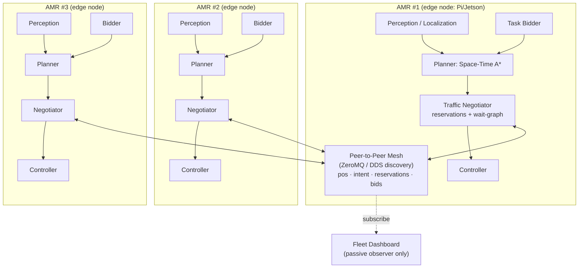
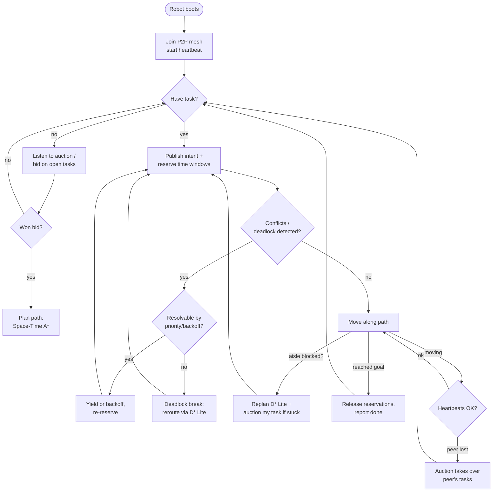
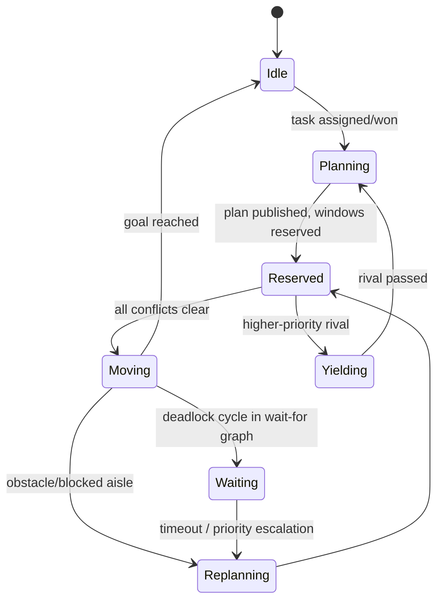

# SIH26123 — Edge-AI Distributed Fleet Coordination for AMRs in Smart Warehouses

> **Org:** Bharat Electronics Limited (BEL) · **Category:** Software · **Theme:** Robotics and Drones
> **Goal:** Decentralized, edge-run coordination for ≥3 AMRs — zero collisions, ≥20% faster than stop-and-wait.

---

## 1. Problem Breakdown

| # | Sub-problem | Core challenge | Our approach |
|---|---|---|---|
| 1 | Decentralized communication | No central server allowed | P2P messaging, peer discovery, heartbeats |
| 2 | Multi-agent path planning | Robots must share space-time | Space-time A* + reservation tables |
| 3 | Conflict & deadlock resolution | Choke points without a referee | Local wait-for graph + priority/aging |
| 4 | Task allocation & re-routing | Blocked aisles, failed robots | Decentralized auctions (contract-net) + D* Lite |
| 5 | Fleet dashboard | Observe only, never coordinate | Passive subscriber UI with live metrics |

**Golden rule:** the dashboard is a *listener*. Any hidden central coordinator = instant disqualification logic.

---

## 2. System Architecture



**Key point:** each robot is a self-contained process (deployed on its own Pi/laptop). The mesh carries position, intent, reservation and auction messages. The dashboard only subscribes.

---

## 3. Robot Decision Loop (Flowchart)



---

## 4. Conflict Resolution State Machine (per robot)



---

## 5. Algorithms (pragmatic picks)

| Layer | Algorithm | Why |
|---|---|---|
| Single-robot planning | **Space-time A*** | Adds a time axis → reservations become natural |
| Dynamic replanning | **D* Lite** | Incremental repair when aisle blocks; fast on edge CPU |
| Intersection control | **Reservation table** (windowed) | Decentralized referee-free traffic lights |
| Deadlock detection | **Wait-for graph** cycles, local view | Cheap, works with partial knowledge |
| Deadlock breaking | Priority + aging + randomized backoff | Guarantees liveness, no starvation |
| Task allocation | **Contract-net auction**: bid = α·dist + β·battery-drain + γ·detour | Simple, visible in demo, near-optimal enough |

Fallback upgrade (if time): CBS (Conflict-Based Search) for optimal MAPF at choke points.

---

## 6. Message Protocol (P2P mesh)

| Topic | Payload | Rate |
|---|---|---|
| `heartbeat` | robot_id, ts, battery, status | 2 Hz |
| `pose` | id, x, y, θ, v | 10 Hz |
| `intent` | id, planned trajectory, reserved windows | on replan |
| `reservation` | id, cell, [t_in, t_out] | on reserve/release |
| `auction_open` | task_id, pickup, drop | on new/stuck task |
| `bid` | id, task_id, cost | within 500 ms window |
| `award` | task_id, winner_id | by current holder |

Transport: ZeroMQ (PUB/SUB + REQ/REP for auctions) with UDP multicast discovery. All messages versioned + timestamped; Lamport clocks for ordering.

---

## 7. Metrics & Baseline (the make-or-break)

PS success criteria are explicit, so we measure live:

- `collisions_total` → target **0**
- `makespan` / total task completion time vs **stop-and-wait baseline**
- avg intersection wait time, reroute count, auction overhead, deadlocks resolved

The naive baseline (robots freeze whenever any other robot is visible ahead) ships as a toggle in the same binary. Dashboard shows:

```
Collisions: 0   |   Makespan improvement vs baseline: +23%   |   Deadlocks resolved: 7
```

---

## 8. Build Roadmap (~36 h)

```mermaid
gantt
    dateFormat HH:mm
    axisFormat %H:%M
    section Core
    Grid world + map generator          :w1, 00:00, 3h
    Single-robot space-time A*          :w2, after w1, 4h
    P2P mesh (discovery, heartbeats)    :w3, 02:00, 4h
    Reservation-table coordination      :w4, after w2, 5h
    Deadlock detect + break             :w5, after w4, 4h
    section Intelligence
    D* Lite blocked-aisle replanning    :w6, after w4, 3h
    Auction-based task allocation       :w7, after w5, 4h
    section Demo
    Baseline mode + metrics             :w8, after w6, 3h
    Dashboard                           :w9, 12:00, 8h
    Scripted scenarios + pitch          :w10, after w8, 4h
    Buffer / edge deployment on Pis     :w11, after w10, 4h
```



**Parallel tracks:** world/sim · planning/conflict · comms/allocation · dashboard/metrics.

---

## 9. Demo Scenarios (scripted, run back-to-back)

1. **Choke point:** 3+ robots converge on one intersection → negotiate, zero collisions.
2. **Blocked aisle:** obstacle appears mid-task → D* Lite reroute; if stuck >T, task goes to auction.
3. **Graceful degradation:** kill a robot mid-run → peers detect lost heartbeat, auction reassigns its tasks.

Each scenario runs twice: baseline vs ours → side-by-side timer on the dashboard.

---

## 10. Risks & Mitigations

| Risk | Mitigation |
|---|---|
| Hidden-central-server accusation | Dashboard read-only; every decision reproducible from robot-local logs |
| Race conditions in auctions | Timed bid windows + deterministic tiebreak (robot_id) |
| Sim-to-edge gap | Same robot code runs in sim and on Pi; only the motion model swaps |
| Time overrun on MAPF tuning | Ship prioritized+reservations first; CBS only as stretch |
| Judges want "AI" | Learning-based dwell-time prediction at intersections as bonus slide |

---

## 11. Repo Layout

```
sih26123/
├── world/            # grid maps, warehouse generator
├── robot/
│   ├── planner.py        # space-time A*, D* Lite
│   ├── negotiator.py     # reservations, wait-for graph
│   ├── bidder.py         # contract-net auctions
│   └── comms.py          # ZeroMQ mesh, heartbeats
├── baseline/         # stop-and-wait reference
├── dashboard/        # web UI (WebSocket feed)
├── sim/              # runner: N processes, scripted events
├── metrics/          # collectors, comparison reports
└── deploy/           # systemd units / Docker per Pi
```
