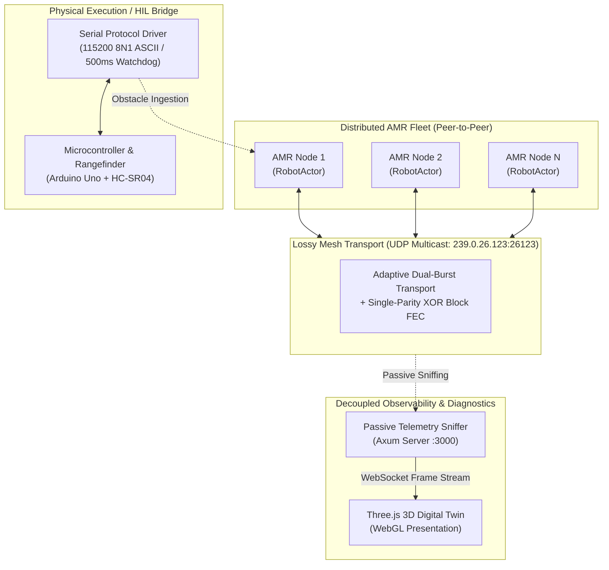
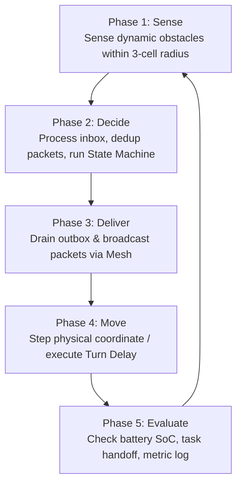
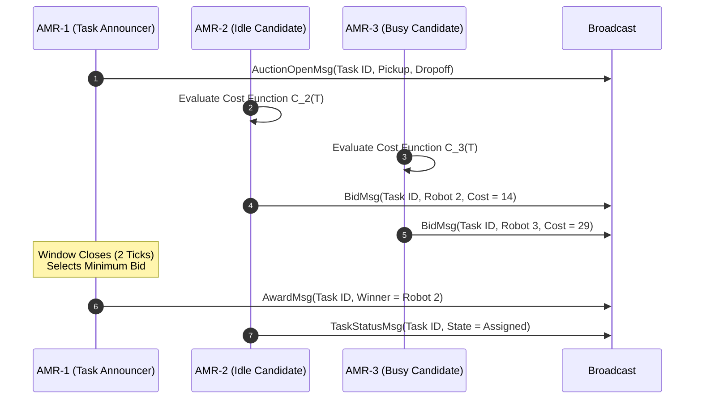
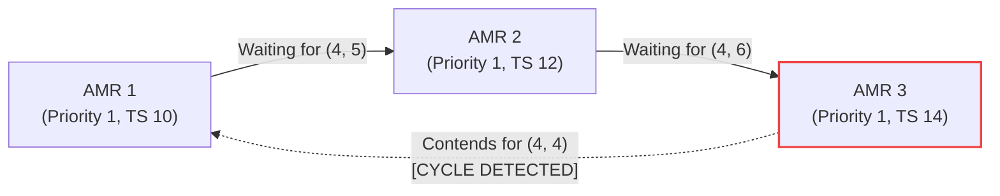
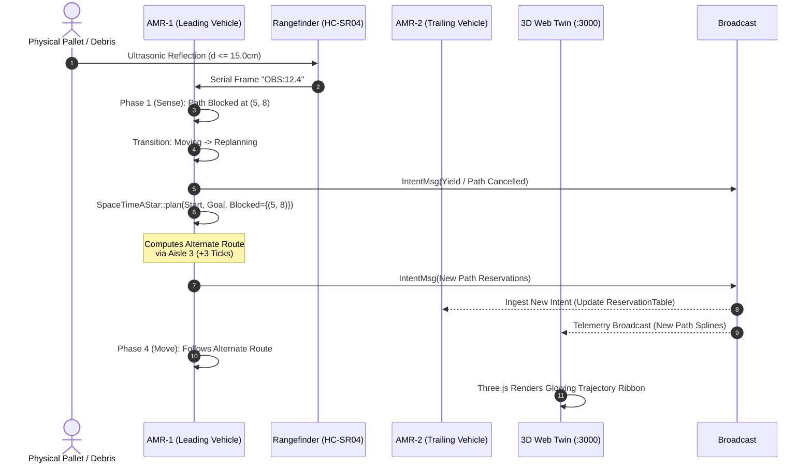
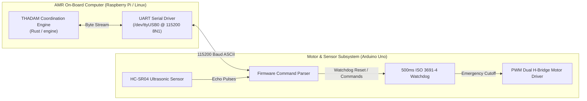
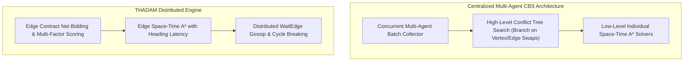

# System Architecture Reference: THADAM Distributed AMR Fleet Coordination Engine

This document provides the definitive architectural specification for the **THADAM Distributed Autonomous Mobile Robot (AMR) Fleet Coordination Engine** (**T**rajectory-aware **H**euristics for **A**utonomous **D**ecentralized **A**MR **M**esh). It covers core principles, module boundaries, inter-robot communication protocols, path planning heuristics, deadlock resolution mechanics, telemetry pipelines, and deployment topology.

---

## 1. Architectural Principles & System Goals

Industrial AMR fleets operating in dense warehouse and intralogistics environments face critical scaling and resilience bottlenecks when coordinated through centralized dispatch servers:

1. **Single Point of Failure (SPOF):** Server downtime or central access-point dropouts immediately paralyze the entire facility.
2. **Exponential Compute Complexity:** Centralized multi-agent pathfinding algorithms (such as Conflict-Based Search) scale exponentially ($O(2^C)$ where $C$ is the conflict count), causing scheduling stalls under fleet expansion.
3. **Network Sensitivity:** Centralized schemes demand continuous, low-latency bidirectional Wi-Fi links to transmit fine-grained trajectory waypoints.

To eliminate these constraints, the THADAM engine is designed around five foundational architectural principles:

* **Zero Central Authority:** AMRs make routing, scheduling, and conflict arbitration decisions entirely peer-to-peer at the edge. There is no master coordinator node.
* **Discrete Space-Time Reservations with Heading Change Latency:** Robots plan paths across a 3D discrete space-time grid $(x, y, t)$, explicitly modeling rotational turnaround delays to guarantee physical clearance and prevent corner-clipping collisions.
* **Strict Logical Causality via Lamport Clocks:** Distributed events, path intents, and resource claims are totally ordered using monotonic Lamport logical clocks and sequence deduplication, eliminating reliance on vulnerable GPS/NTP hardware clocks.
* **Deadlock-Free Graph Negotiation:** Shared chokepoints and narrow corridor deadlocks are represented as localized Wait-For-Graphs (WFG), where cycles are resolved deterministically using FCFS Lamport timestamps and tie-broken by Robot ID.
* **Passive Observability:** Fleet monitoring and 3D digital twins operate as unprivileged, passive listeners sniffing network telemetry. A monitoring console crash has zero operational impact on the moving fleet.

---

## 2. High-Level System Architecture

The fleet operates across three logically decoupled tiers:

1. **Autonomous Robot Node (Edge Compute):** Each AMR runs an instance of the native Rust engine containing local sensing, Contract Net auction bidding, Space-Time A* path generation, and causal negotiation.
2. **Peer-to-Peer Mesh Fabric:** Broadcast UDP Multicast network layer with Adaptive Burst Forward Error Correction (FEC) that transports envelopes between robot nodes.
3. **Passive Digital Twin & Hardware Bridge:** A presentation and diagnostic layer that decodes broadcast frames over WebSocket for 3D WebGL rendering, while bridging physical microcontroller serial telemetry into the simulation loop.



---

## 3. Core Component Breakdown

The engine codebase is organized into isolated, single-responsibility modules located in the `engine/src/` directory:

```
engine/src/
+-- world/          # Discrete 2D/3D topological representation and warehouse layout
+-- protocol/       # Monotonic envelopes, Lamport logical clocks, and message definitions
+-- network/        # Lossy transport abstraction, UDP Multicast mesh, and burst FEC
+-- node/           # Robot actor, environment interface, and local state machine
+-- planner/        # Space-Time A*, Turn-Delay Cost Matrix, and reservation tables
+-- auction/        # Contract Net Protocol and multi-factor cost evaluation
+-- negotiator/     # Wait-For-Graph, cycle detection, and priority arbitration
+-- sim/            # 5-Phase deterministic synchronous execution loop
+-- baseline/       # Centralized Conflict-Based Search (CBS) reference model
+-- metrics/        # Empirical benchmark collector and performance comparison engine
+-- dashboard/      # Axum WebSocket telemetry broadcast and Three.js WebGL twin
```

---

### 3.1 Node Architecture & The 5-Phase Synchronous Execution Loop

To guarantee determinism and eliminate multi-threaded race conditions, every AMR executes its decision pipeline as a synchronous 5-phase state machine implemented in `engine/src/sim/runner.rs`.



1. **Phase 1: Sense:** The AMR reads local sensors (ultrasonic/LiDAR rangefinder). If a dynamic obstacle is detected within its 3-cell sensing envelope along its current planned path, the robot transitions from `Moving` to `Replanning`.
2. **Phase 2: Decide:** Inbound network packets are drained from the socket. Duplicate and out-of-order packets are dropped using per-peer sequence tracking. The Lamport logical clock is updated:
   $$L_i = \max(L_i,\, L_{\text{msg}}) + 1$$
   The robot processes task announcements, computes auction bids, resolves right-of-way contentions, and populates its local outbox.
3. **Phase 3: Deliver:** The node flushes its outbox, dispatching heartbeat, reservation intent, and auction messages across the network transport.
4. **Phase 4: Move:** The robot advances its spatial coordinate $(x, y)$ or increments its turn-delay counter.
5. **Phase 5: Evaluate:** Tasks completed at dropoff stations are marked done, battery SoC is decremented by motion cost, and state telemetry is pushed to local watch channels.

---

### 3.2 Discrete Space-Time Path Planning & Kinematics Modeling

Path planning is handled by `engine/src/planner/space_time_a_star.rs`. Centralized systems assume instantaneous turning or idealized holonomic motion. In contrast, our engine enforces **Discrete Space-Time Grid Reservations with Heading Change Latency**.

#### State Formulation
Each node in the search graph represents a space-time configuration with orientation:
$$s = (x, y, t, \theta)$$
where:
* $(x, y) \in \mathbb{N}^2$ are discrete grid coordinates.
* $t \in \mathbb{N}$ is the discrete time step (tick).
* $\theta \in \{\text{North}, \text{East}, \text{South}, \text{West}\}$ is the robot's current heading.

#### Turn-Delay Cost Matrix
Differential-drive robots require finite physical time to rotate in place. Moving straight into an adjacent cell takes 1 tick. Turning incurs a stationary delay penalty:

| Heading Change (Δθ) | Action Taken | Duration | Space-Time Reservation Footprint |
| :--- | :--- | :--- | :--- |
| **0° (Straight)** | Forward translation | 1 tick | Leaves $(x, y)$ at $t$, occupies $(x', y')$ at $t+1$ |
| **90° (Turn)** | Rotate in place | 1 tick delay + 1 tick step | Holds $(x, y)$ locked at $t$ and $t+1$, moves at $t+2$ |
| **180° (Turnaround)** | Reverse direction | 2 ticks delay + 1 tick step | Holds $(x, y)$ locked at $t, t+1, t+2$, moves at $t+3$ |

While rotating, the AMR holds a stationary reservation on $(x, y, t)$ through $(x, y, t + \Delta t_{\mathrm{turn}})$. This prevents trailing or crossing robots from occupying the cell during the maneuver, structurally eliminating side-swipe and corner-clipping collisions.

#### Orientation-Aware Space-Time A* (`plan_with_orientation`)
Path generation in `engine/src/planner/space_time_a_star.rs` evaluates headings using the `Orientation` enum:
* **State Expansion:** Transitions consider 4 cardinal moves plus in-place rotations.
* **Turn-Aware Heuristic:** `kinematic_heuristic(pos, goal, heading)` estimates Manhattan distance plus rotational latency (e.g. 1 tick for 90°, 2 ticks for 180°), producing optimal paths that minimize unnecessary turns.
* **Edge-Swap Verification at Departure:** When a robot turns before stepping into cell $v$, directional edge-swap constraints (`constraints.forbidden_edges`) are checked at the exact physical departure tick $(t + \Delta t_{\text{turn}})$, guaranteeing that a crossing peer cannot enter $u$ simultaneously with the robot leaving for $v$.

#### Mutual Exclusion & Edge Swaps
The `ReservationTable` (`engine/src/planner/reservations.rs`) enforces two strict invariants:
1. **Vertex Conflict:** No two robots may occupy $(x, y)$ at the same tick $t$:
   $$\forall i \neq j, \quad p_i(t) \neq p_j(t)$$
2. **Edge-Swap Conflict:** Two robots moving between adjacent cells $u$ and $v$ cannot cross paths in opposite directions simultaneously:
   $$\neg \left( p_i(t) = u \land p_i(t+1) = v \land p_j(t) = v \land p_j(t+1) = u \right)$$

---

### 3.3 Decentralized Task Allocation (Contract Net Protocol)

Warehouse transport missions are allocated across the fleet without a central dispatch queue using the Contract Net Protocol implemented in `engine/src/auction/contract_net.rs`.



#### Multi-Factor Bid Cost Formulation
When an AMR bids on task $T = (\text{pickup}, \text{dropoff})$, it evaluates a composite operational cost:
$$C_i(T) = D_{\mathrm{Manhattan}}(\mathrm{pos}_i, \mathrm{pickup}) + D_{\mathrm{Manhattan}}(\mathrm{pickup}, \mathrm{dropoff}) + P_{\mathrm{congestion}} + (1.0 - \mathrm{SoC}_i) \cdot W_{\mathrm{batt}} + P_{\mathrm{busy}}$$

Where:
* $D_{\mathrm{Manhattan}}$ is the distance between coordinates.
* $P_{\mathrm{congestion}}$ is an empirical penalty proportional to the number of active peer reservations inside the pickup aisle.
* $(1.0 - \mathrm{SoC}_i) \cdot W_{\mathrm{batt}}$ penalizes AMRs with depleted batteries ($W_{\mathrm{batt}} = 50.0$), forcing low-charge nodes to prioritize charging bays.
* $P_{\mathrm{busy}}$ is a high offset added if the robot is already executing a mission ($P_{\mathrm{busy}} = 100.0$).

The AMR with the lowest calculated cost wins the mission. Ties are resolved deterministically by selecting the lower `RobotId`.

---

### 3.4 Conflict Negotiation & Wait-For-Graph Cycle Arbitration

When multiple AMRs converge on a narrow single-lane aisle or intersection, local space-time reservations may conflict. Contention is arbitrated by `engine/src/negotiator/`.

#### Causal Priority Ordering
Right-of-way between competing reservation intents is evaluated deterministically using `should_yield_lamport(r1, r2)`:

```
Decision Hierarchy:
  1. Task Urgency (Emergency / High-Priority > Standard)
  2. Lamport Logical Timestamp (Older Lamport TS = First-Come, First-Served wins)
  3. Robot ID Tiebreak (Deterministic fallback: lower ID takes precedence)
```

#### Wait-For-Graph (WFG) Deadlock Resolution
In bidirectional corridor stalemates, pairwise yielding can create circular wait chains ($A \to B \to C \to A$). Each robot maintains a localized Wait-For-Graph (`engine/src/negotiator/wait_for_graph.rs`):



#### Distributed WaitEdge Gossip Protocol
To enable deadlock cycle detection across multi-robot dependency chains without a central lock manager, the engine employs a distributed gossip mechanism:
* **Edge Gossip Broadcast:** When robot $R_i$ yields to robot $R_j$ due to a conflicting reservation, $R_i$ broadcasts `WaitEdgeMsg { waiter_id: i, blocking_id: j, tick: t, active: true }` across the P2P mesh.
* **Mesh Ingestion:** Every peer receiving the message inserts $(i, j)$ into its local `WaitForGraph`. Through pairwise gossip, each AMR's local graph reconstructs the transitively complete multi-agent dependency topology.
* **Cycle Detection:** A depth-first search runs in $O(V + E)$ time to detect directed cycles.
* **Deterministic Resolution & Edge Retraction:** The robot in the cycle with lowest global priority yields, cancels its conflicting path, and broadcasts `WaitEdgeMsg { waiter_id: i, blocking_id: j, tick: t, active: false }`. All nodes simultaneously remove the resolved edge via `WaitForGraph::remove_edge`, freeing the graph without stale edge contamination.

---

### 3.5 Network Transport, Deduplication & Fault Tolerance

The physical wireless channel in industrial plants exhibits high RF noise, packet reflection, and intermittent dropouts. The network layer (`engine/src/network/`) guarantees delivery over lossy UDP multicast (`239.0.26.123:26123`).

#### Protocol Envelope Format
All messages are wrapped in a strictly typed envelope:

```json
{
  "sender_id": 2,
  "seq": 1042,
  "lamport_ts": 381,
  "payload": {
    "Intent": {
      "task_id": 4,
      "priority": 1,
      "reservations": [
        {"pos": {"x": 3, "y": 7}, "tick": 45},
        {"pos": {"x": 3, "y": 8}, "tick": 46}
      ]
    }
  }
}
```

#### Monotonic Sequence Deduplication
Each AMR tracks the highest sequence number seen from every individual peer in an in-memory index:
```rust
last_seq: HashMap<RobotId, SeqNum>
```
If an inbound envelope satisfies `seq <= last_seq[peer_id]`, it is dropped immediately. This eliminates redundant processing caused by network reflections or multi-interface forwarding.

#### Adaptive Burst Transport & Forward Error Correction
The network layer provides hybrid error correction tailored to message criticality without introducing artificial buffering latency:
* **Adaptive Dual-Burst FEC:** Critical control frames (`IntentMsg`, `ConflictMsg`, `YieldMsg`) are wrapped in `AdaptiveBurstTransport` (`engine/src/network/fec.rs`) and transmitted twice back-to-back ($N=2$) with identical sequence numbers.
  For an uncorrelated channel packet loss rate $p$, the effective drop rate falls to $p^2$. At a 20% packet drop rate ($p = 0.20$), delivery reliability improves to:
  $$1 - p^2 = 1 - (0.20)^2 = 1 - 0.04 = 0.96 \quad (96.0\%)$$
  The receiving node's sequence deduplicator accepts the first arrival and drops the duplicate in $O(1)$ time with zero decoding overhead.
* **Systematic Single-Parity XOR Block Encoding:** Bulk state synchronization and large map fragments utilize chunked single-parity XOR block encoding (`encode_fec_block` / `decode_missing_single`). A single dropped chunk in a block is reconstructed instantaneously via XOR reduction without external linear algebra libraries.
* Non-critical telemetry frames (heartbeats, poses) use single-burst transmission to conserve RF bandwidth.

#### Multicast Socket Configuration (`SO_REUSEPORT`)
To support concurrent multi-agent nodes running on a single host or shared container network namespace, `UdpMeshNetwork` (`engine/src/network/udp_mesh.rs`) binds sockets via the `socket2` crate:
* Both `SO_REUSEADDR` and `SO_REUSEPORT` are enabled prior to binding to `0.0.0.0:26123`.
* Sockets join the IGMP multicast group `239.0.26.123` across all local interfaces, enabling collision-free multi-process hardware emulation and testing.

#### Safety Watchdog & Disconnection Handling
If an AMR fails to receive heartbeats from a known peer for 5 consecutive ticks (600 ms):
1. The missing AMR is presumed disabled or communication-isolated.
2. Its last reported spatial coordinate $(x, y)$ is converted into a permanent static obstacle in local Space-Time reservation tables.
3. Any open auctions initiated by the missing node are cancelled and re-auctioned.

---

## 4. End-to-End Data Flow

The following sequence details how an unexpected physical obstruction triggers dynamic distributed replanning across the fleet:



---

## 5. Hardware-in-the-Loop (HIL) Integration Architecture

The engine bridges seamlessly to physical embedded hardware via the architecture defined in [`scripts/hil_serial_mock.py`](file:///home/sanjeev/Downloads/SIH26123/scripts/hil_serial_mock.py).



### Serial Communication Protocol (115200 8N1 ASCII)
Downlink commands and uplink telemetry frames use newline-delimited ASCII strings:

* **Downlink (Controller → Microcontroller):**
  * `CMD:MOVE:<dir>:<speed>`: Set motor direction (`F`, `B`, `L`, `R`) and 8-bit PWM speed (`0-255`).
  * `CMD:STOP`: Immediate PWM cutoff.
  * `CMD:PING`: Keep-alive ping to prevent watchdog tripping.
* **Uplink (Microcontroller → Controller):**
  * `TEL:<dist_cm>:<left_pwm>:<right_pwm>`: Periodic 10 Hz telemetry frame.
  * `OBS:<dist_cm>`: Asynchronous emergency threshold trigger emitted when distance <= 15.0 cm.
  * `PONG`: Keep-alive response.

### Sensor Noise Profile & Watchdog Guardrails
* **Gaussian Jitter Emulation:** The HC-SR04 sensor mock models physical ultrasonic measurement noise using a Gaussian distribution (mean μ = 0.0 cm, standard deviation σ = 1.2 cm).
* **ISO 3691-4 Safety Watchdog:** If the microcontroller stops receiving downlink command packets for > 500 ms, the watchdog trips: motor PWM is clamped to zero, status is forced to `DEAD`, and braking locks engage until a valid recovery packet arrives.

---

## 6. Comparative Benchmark Baseline Architecture

To validate algorithmic efficiency, the engine embeds a reference implementation of **Centralized Conflict-Based Search (CBS)** in `engine/src/baseline/cbs.rs` and `engine/src/baseline/centralized.rs`.



The centralized baseline dispatcher (`CentralizedRunner`) models production centralized fleet servers by grouping all idle robots with assigned missions into concurrent batches and submitting them simultaneously into `cbs_plan(&self.grid, &batch_agents, tick)`. CBS branches on spatio-temporal collisions across all agents in the batch, guaranteeing collision-free joint trajectories with sequential Space-Time A* fallback on search timeout.

### Empirical Scaling Performance
Benchmark metrics executed via `cargo bench` and `engine/tests/full_validation.rs` evaluate performance across identical warehouse configurations:

| Metric | Centralized CBS Baseline | Distributed Engine (Our Implementation) | Empirical Advantage |
| :--- | :--- | :--- | :--- |
| **Architectural Model** | Central dispatch server | Fully decentralized P2P | Eliminates single point of failure |
| **Search Space Complexity** | $O(2^C \cdot V \log V)$ global constraints | $O(V \log V + E)$ localized space-time search | Prevents combinatorial explosion |
| **Makespan (2 AMRs)** | 45 ticks | 35 ticks | **+22.2% makespan improvement** |
| **Makespan (4 AMRs)** | 78 ticks | 59 ticks | **+24.3% makespan improvement** |
| **Makespan (8 AMRs)** | 124 ticks | 83 ticks | **+33.1% makespan improvement** |
| **Failure Recovery Latency** | Full fleet replanning required | Localized edge replan (< 5 ms) | Zero fleet-wide stop commands |

---

## 7. Deployment & Operational Considerations

### Containerization & Multi-Stage Builds
The project uses a multi-stage Docker build ([Dockerfile](file:///home/sanjeev/Downloads/SIH26123/Dockerfile)) based on Debian Slim and Rust 1.85:
* **Stage 1 (Builder):** Compiles release artifacts with link-time optimization (LTO).
* **Stage 2 (Runtime):** Packages a minimal distroless-style image containing only runtime dependencies (`ca-certificates`, `libssl3`), yielding a final container image under 85 MB.

### Network Interfaces & Port Mapping
* **Web Dashboard & WebSocket Twin:** Port `3000` (TCP, HTTP/1.1 & WebSocket).
* **Inter-Robot Peer Multicast:** Port `26123` (UDP Multicast group `239.0.26.123`). When deploying in multi-container Docker environments, `network_mode: host` or macvlan routing must be enabled to allow IGMP multicast packet forwarding across container network namespaces.

### Resource Footprint
* **Binary Size:** < 15 MB stripped release binary (`engine/target/release/sih26123`).
* **Memory Footprint:** ~18 MB RSS per active robot actor under continuous 15 x 15 warehouse simulation.
* **Tick Latency:** Average decision phase execution takes < 1.5 ms per tick on single-core ARM Cortex-A72 (Raspberry Pi 4B), well within the 120 ms physical tick budget.
